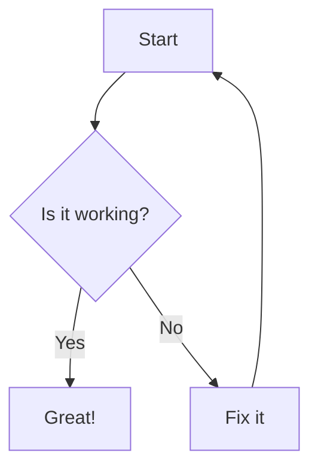
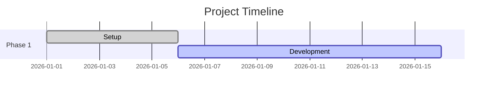

# Test Mermaid Diagram

```mermaid
graph TD
    A[Start] --> B{Is it working?}
    B -->|Yes| C[Great!]
    B -->|No| D[Fix it]
    D --> A
```

## Timeline

```mermaid
gantt
    title Project Timeline
    dateFormat YYYY-MM-DD
    section Phase 1
    Setup           :done, 2026-01-01, 5d
    Development     :active, 2026-01-06, 10d
```

Regular text continues here.
